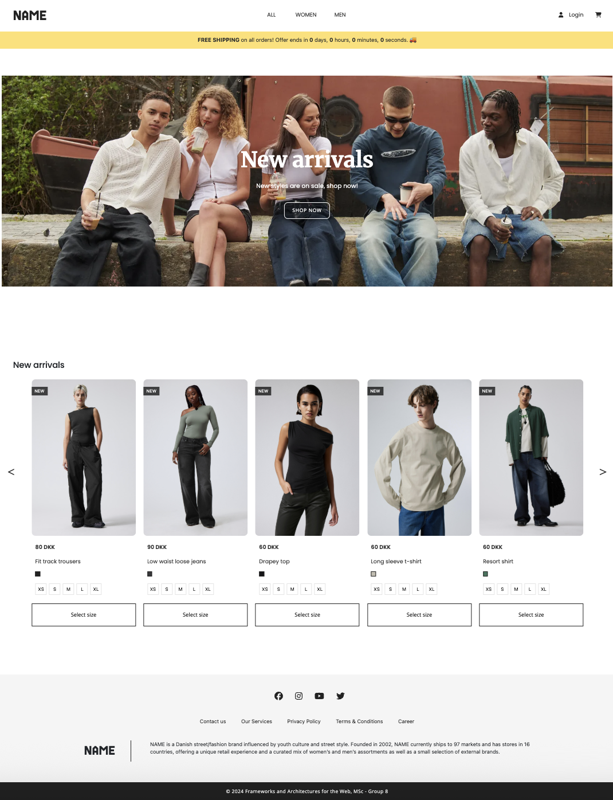

### ﹅ NAME (E-commerce Clothes Shop) 🛒

This project, our group developed a webshop focused on selling clothes as a **Final Project for ITU (Information Technology University)**. Our online store allows users to shop as registered or unregistered guests, explore new arrivals, and browse clothing items through dedicated tabs for Women and Men or all clothes at once. Within these categories, users can filter products by specific criteria such as type of clothing, material and color, select their preferred size and add items to their personal carts.

Our primary goal was to create a website that adheres to general design principles and
follows industry standards, ensuring a seamless and intuitive user experience. The client side of the application is built using React and Typescript, providing a dynamic and responsive interface. On the server side, we implemented a RESTful API using JavaScript and Node.js (specifically Express), which supports efficient and reliable backend operations.

<br>

### ﹅ Tech Stack

- **Frontend**: React, JavaScript, TypeScript, HTML, CSS
- **Backend**: Node.js, Express, REST
- **Graphic design**: Photoshop

<br>

### ﹅ Preview

   

<br>

### ﹅ Features

- 👤 User registration and guest checkout  
- 🔍 Product filtering by category, material, color, and size  
- 🛒 Shopping cart management  
- 📱 Responsive design for various devices  

<br>

### ﹅ Installation

```bash
git clone https://github.com/dyoungky/ITU-FinalProject-NAME.git
cd ITU-Name
npm install
npm start
